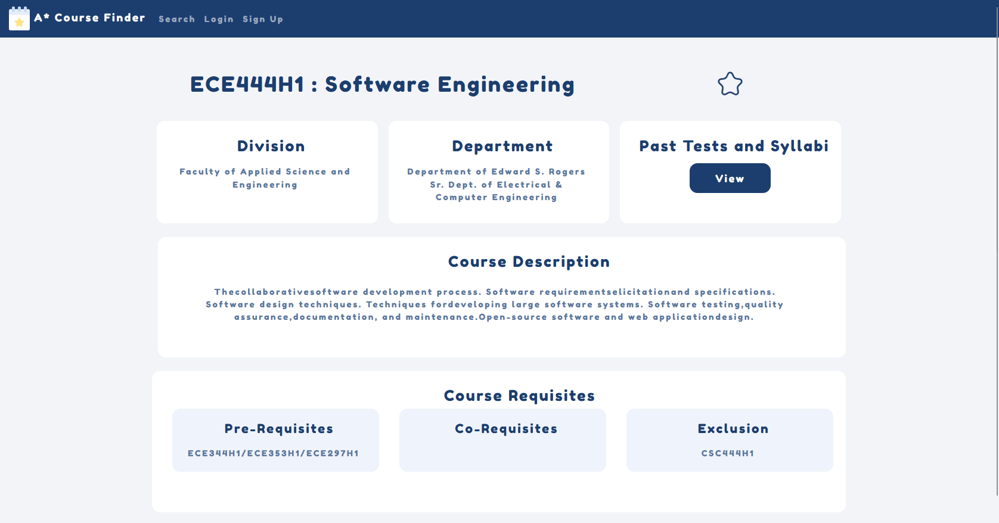

# AStar Course Chooser

The AStar Course chooser is user-friendly course selection platform designed to help students manage and organize their academic schedules efficiently.

<figure align="center">

<figcaption>The AStar Chooser Homepage</figcaption>
</figure>

<figure align="center">

<figcaption>The course description page of the course ECE444H1</figcaption>
</figure>

# Tech Stack

- **Frontend:** Next.js – A React framework for building fast and user-friendly web applications.
- **Backend:** Flask – A lightweight WSGI web application framework for building scalable APIs.
- **Database:** MySQL – Managed through SQLAlchemy ORM for handling data models and queries.
- **Search & Cloud:**
  - AWS RDS for scalable and secure database management.
  - AWS Elasticsearch for fast and efficient course search functionality.
- **Authentication:** The login system is secured using JWT (JSON Web Tokens), with tokens stored in HTTP-only cookies to manage user sessions securely.

# Features

- **Course Search:** Search for courses by Course Code, or by keywords
- **Wishlist:** Create a wishlist of courses you'd like to take in future terms
- **User Authentication:** Create an account, sign in, and save your preferred wishlist.

# Hosting

This application is currently hosted at https://www.terryluan.com/astar
